# Custom Configuration Profiles in JumpCloud

JumpCloud supports the management of Custom MDM Configuration [profiles](https://developer.apple.com/documentation/devicemanagement/using_configuration_profiles?language=objc) through [Custom MDM Profiles](https://jumpcloud.com/blog/custom-configuration-profiles). Tools like [imazing Profile Editor](https://imazing.com/profile-editor/download) or [Apple Configurator 2](https://apps.apple.com/us/app/apple-configurator-2/id1037126344?mt=12) can be used to generate .mobileconfig files which contain preferences for systems and macOS applications.

## Table of Contents

- [Custom Configuration Profiles in JumpCloud](#custom-configuration-profiles-in-jumpcloud)
  - [Table of Contents](#table-of-contents)
  - [General settings for Profiles](#general-settings-for-profiles)
  - [Configuration Profile Examples](#configuration-profile-examples)
    - [Catalina Notifications Profile](#catalina-notifications-profile)
    - [Firefox Custom Profile](#firefox-custom-profile)
    - [Chrome Custom Profile](#chrome-custom-profile)
    - [Custom Dock Profile](#custom-dock-profile)
    - [Custom Font Distribution](#custom-font-distribution)
    - [Disable Airdrop](#disable-airdrop)
    - [Radius EAP-TTLS/PAP Network Profile](#radius-eap-ttlspap-network-profile)
      - [Manually Configure the Radius Profile](#manually-configure-the-radius-profile)
      - [Use the Radius Profile Template](#use-the-radius-profile-template)
    - [Create a System Extension Profile](#create-a-system-extension-profile)
      - [Distributing an App with System Extension Profile](#distributing-an-app-with-system-extension-profile)
      - [Google Santa distribution steps](#google-santa-distribution-steps)
    - [Create a Privacy Preference Policy Control Profile](#create-a-privacy-preference-policy-control-profile)
      - [About PPPC Profiles](#about-pppc-profiles)
      - [Example PPPC Profile](#example-pppc-profile)
      - [Example PPPC Profile for the JumpCloud Agent](#example-pppc-profile-for-the-jumpcloud-agent)
  - [Export a profile](#export-a-profile)
  - [Other Considerations](#other-considerations)
    - [UUID of generated profiles](#uuid-of-generated-profiles)
    - [Removal of profiles](#removal-of-profiles)
  - [.mobileconfig Profile Examples](#mobileconfig-profile-examples)

## General settings for Profiles

When opening iMazing Profile Editor for the first time, it's advised to set organizational identifiers. Profiles exported are then identified with the organizational identifiers.


Consider setting an organization name and identifier, profiles distributed to systems via the JumpCloud Custom MDM profile or commands will display an organizational identifier on each distributed profile.

## Configuration Profile Examples

Profiles examples below should be tested before distribution to production systems. The following example profiles should serve as inspiration for developing your own profiles. Polices with the same configuration payload can conflict and cause unwanted behavior. Ex. A Policy with a Login Window Payload can conflict with a second policy that also contains a Login Window Payload - Please test all policies.

### Catalina Notifications Profile

As of the release of macOS Catalina 10.15 users are prompted to allow or deny specific applications from prompting notification banners. This custom policy can be used to set the allow or deny preference on a per application basis.

This specific profile will allow the JumpCloud tray application to send the user notifications.

To create a new profile, open iMazing Profile Editor and click the [ + ] icon.

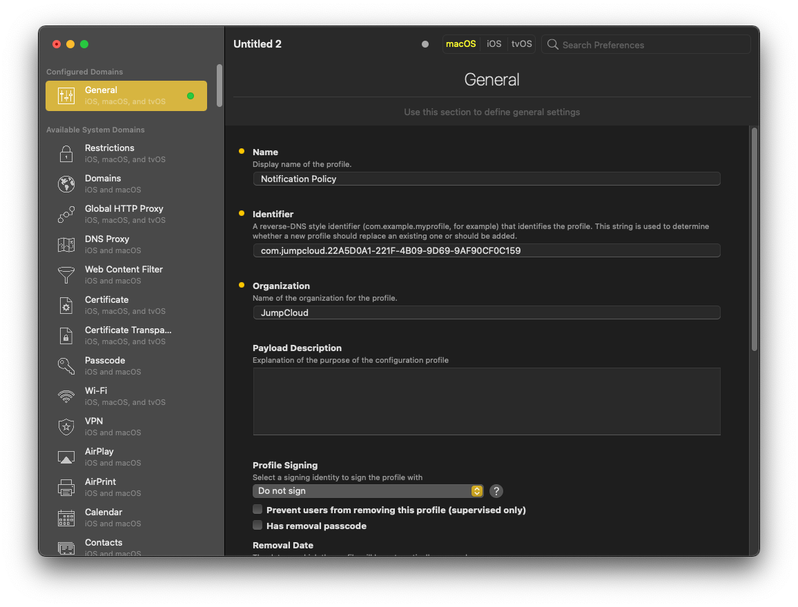

Select a name for the policy, add a description and change the organization name if the settings were not applied by default. Depending on the policy scope, a profile can be applied at the System or User level. In this example the notification payload is a System level payload.

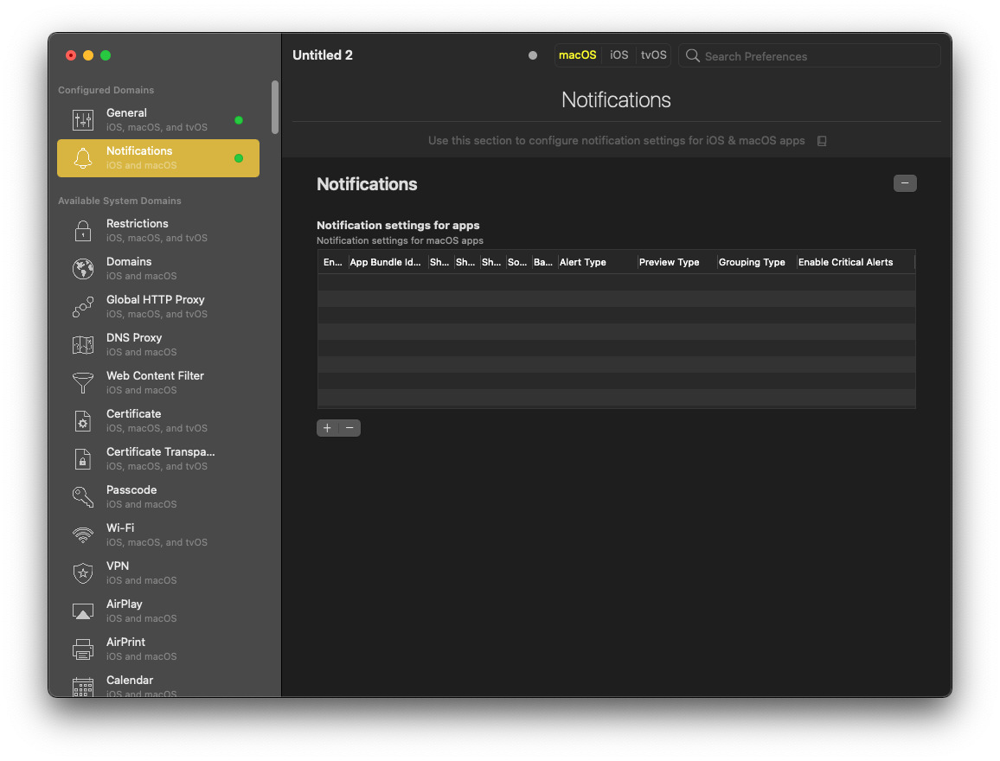

Scroll down the left column profile template window, under macOS select the Notifications Payload, add the payload and add the notification settings preference so that the window is editable like the example below. Profiles selected as part of the profile payload are listed in top left column under the General tab.


In order to add applications to the payload the "App Bundle Identifier" name is required. There are several methods for identifying an applications "App Bundle Identifier". A quick way to identify an given "App Bundle Identifier" is to run the following command, substituting "Microsoft Excel" for the name of an application as it exists in a systems /Applications window.

```bash
osascript -e 'id of app "Microsoft Excel"'
```


The result of that command run against the JumpCloud application is: `com.jumpcloud.jcagent-tray`. Copy that value into the "App Bundle Identifier" for the Notification payload preference. In the example image below the `com.apple.iCal` notification settings are also applied. Note the difference between "Alert Types" between the two preferences. Refer to Apple's documentation on [alert types](https://developer.apple.com/design/human-interface-guidelines/macos/system-capabilities/notifications/) for more information.


Save and [Export](#export-a-profile) the profile for deployment. Distribute to JumpCloud systems through [Custom MDM profiles](https://jumpcloud.com/blog/custom-configuration-profiles).

### Firefox Custom Profile

Firefox or other browsers can be configured to accept settings from a profile. To create an application manifest payload. Select the application icon and add the Firefox profile. Ensure the EnterprisePoliciesEnabled checkbox is ticked like the example below:

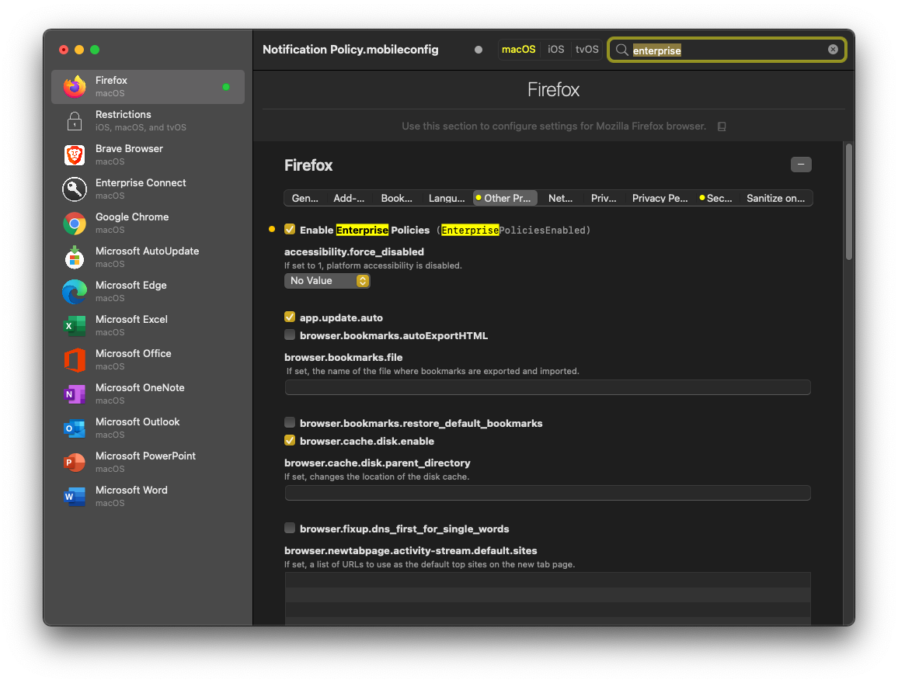

Add a setting like default homepage like the example below. Save and [export the policy](#export-a-profile).


Save and [Export](#export-a-profile) the profile for deployment. Distribute to JumpCloud systems through [Custom MDM profiles](https://jumpcloud.com/blog/custom-configuration-profiles)

### Chrome Custom Profile

Chrome settings and other browser settings can be managed through a custom configuration profile. The Chrome profile in this example will silently install extensions. To create an application manifest payload. Select the application icon in iMazing Profile Editor and add the Chrome profile. Under the 'Extensions' settings, scroll to the "Extension/App IDs and update URLs to be silently installed:

Each Chrome Extension has a unique ID, when entered in this payload, Chrome will silently reference that ID and install that Extension on a systems Chrome Browser.

To find a Chrome Extension's unique ID, visit the [Chrome Extension Web Store](https://chrome.google.com/webstore/category/extensions?hl=en) search for a desired extension and take note of the unique ID in the extensions URL - this ID value can be entered in the Chrome extension profile to silently install Extensions on systems. The highlighted value in the photo below is the unique ID for the ublock origin extension.

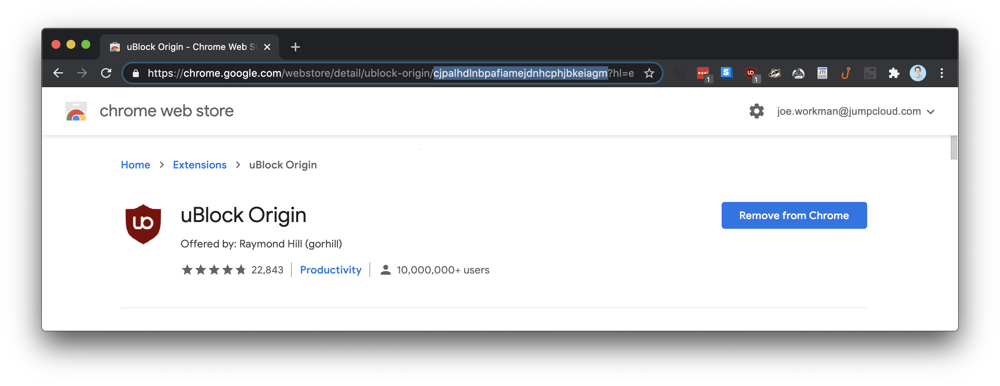

Unique ID's from several extensions can be populated in the same payload like the example below:

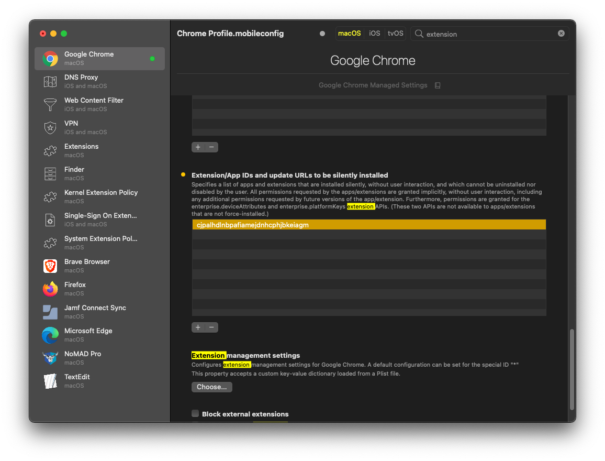

### Custom Dock Profile

An admin can configure a custom dock payload for their systems using iMazing Profile Editor. The example payload below demonstrates a configuration to add Chess, Calendar and Terminal to the users dock. (Note. This configuration will only work with Catalina systems since only Catalina OS has system applications Stored under the `/System/Applications/` path)

This example sets the dock pixel size to 24px and positions the dock on the left side of the screen.

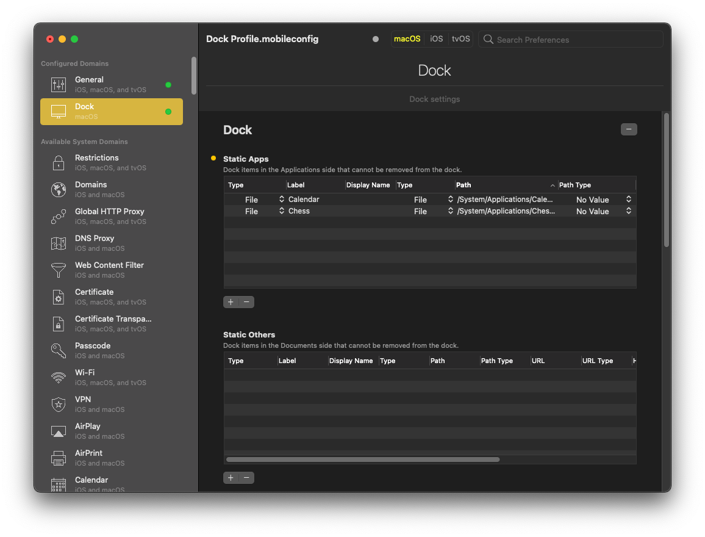

Save and [Export](#export-a-profile) the profile for deployment. Distribute to JumpCloud systems through [Custom MDM profiles](https://jumpcloud.com/blog/custom-configuration-profiles)

### Custom Font Distribution

Individual Fonts or Font Families can be distributed through custom profiles. The Payload example below contains four Font Payloads. Clicking the [+] icon next to payload allows a user to add additional payloads to the profile. In the example below, [Google's Roboto Mono for Powerline](https://github.com/powerline/fonts/tree/master/RobotoMono) font is being distributed along with the Bold, Medium and Light font variants in the other payloads.


(note: Font payloads must be under 1MB to comply with the JumpCloud command file size limit)

Save and [Export](#export-a-profile) the profile for deployment. Distribute to JumpCloud systems through [Custom MDM profiles](https://jumpcloud.com/blog/custom-configuration-profiles).

### Disable Airdrop

A profile to disable AirDrop can be distributed as a custom profile. The Payload example below contains a single Payload to disable AirDrop. Click the Apple Icon and add the AirDrop (macOS) Payload to a profile. Click the Disable AirDrop checkbox to ensure AirDrop is disabled on systems with this profile. Systems must be restarted for the profile to apply.

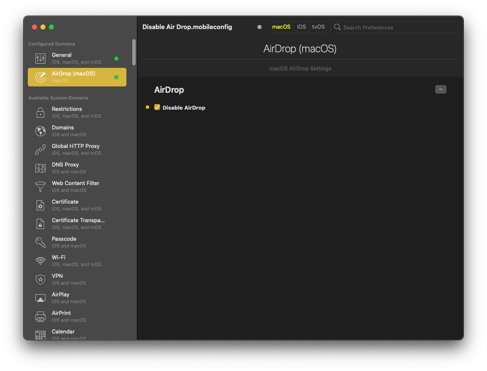

Save and [Export](#export-a-profile) the profile for deployment. Distribute to JumpCloud systems through [Custom MDM profiles](https://jumpcloud.com/blog/custom-configuration-profiles).

### Radius EAP-TTLS/PAP Network Profile

A profile containing the JumpCloud Radius Certificate and network settings can be configured and distributed to systems with a [Custom MDM profile](https://jumpcloud.com/blog/custom-configuration-profiles).

*Prerequisites*:

- [Configuring RADIUS Servers in JumpCloud](https://support.jumpcloud.com/support/s/article/configuring-radius-servers-in-jumpcloud1)
- [Configuring a Wireless Access Point (WAP), VPN or Router for JumpCloud’s RADIUS](https://support.jumpcloud.com/support/s/article/configuring-a-wireless-access-point-wap-vpn-or-router-for-jumpclouds-radius1-2019-08-21-10-36-47)

#### Manually Configure the Radius Profile

JumpCloud has previously posted instructions to configure this profile [using Apple Configurator 2](https://support.jumpcloud.com/support/s/article/eap-ttlspap-configuration-on-mac--ios-devices-for-jumpcloud-radius-clients1-2019-08-21-10-36-47). Create the profile from scratch by following the [instructions on JumpCloud's support site](https://support.jumpcloud.com/support/s/article/eap-ttlspap-configuration-on-mac--ios-devices-for-jumpcloud-radius-clients1-2019-08-21-10-36-47), it is not necessary to sign the profile since the profile will be signed with the MDM Push Notification Certificate when uploaded to JumpCloud as a [Custom MDM profile](https://jumpcloud.com/blog/custom-configuration-profiles).

#### Use the Radius Profile Template

Download the [JumpCloud Radius .mobileconfig template](profiles/JumpCloudRadius.mobileconfig) and open the file with Apple Configurator 2.

Change the SSID to match your RADIUS Server SSID

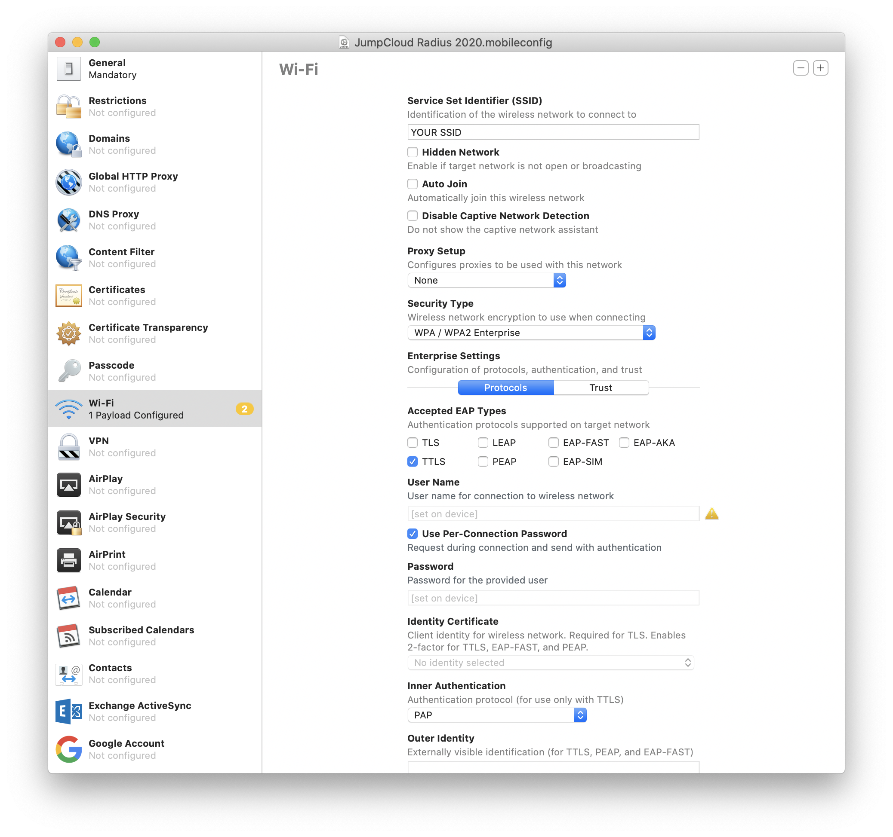

Add the JumpCloud Radius Server Certificate to the profile

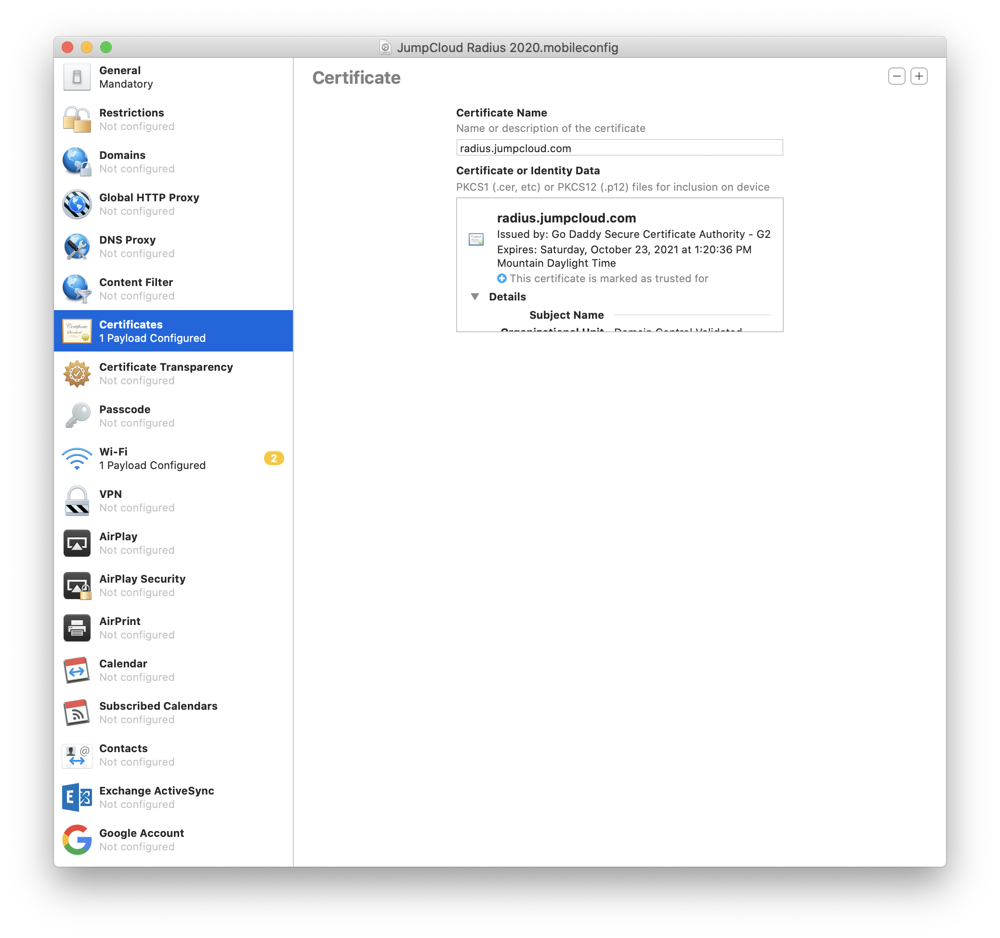

Add the Radius Cert to the Wifi payload within the profile

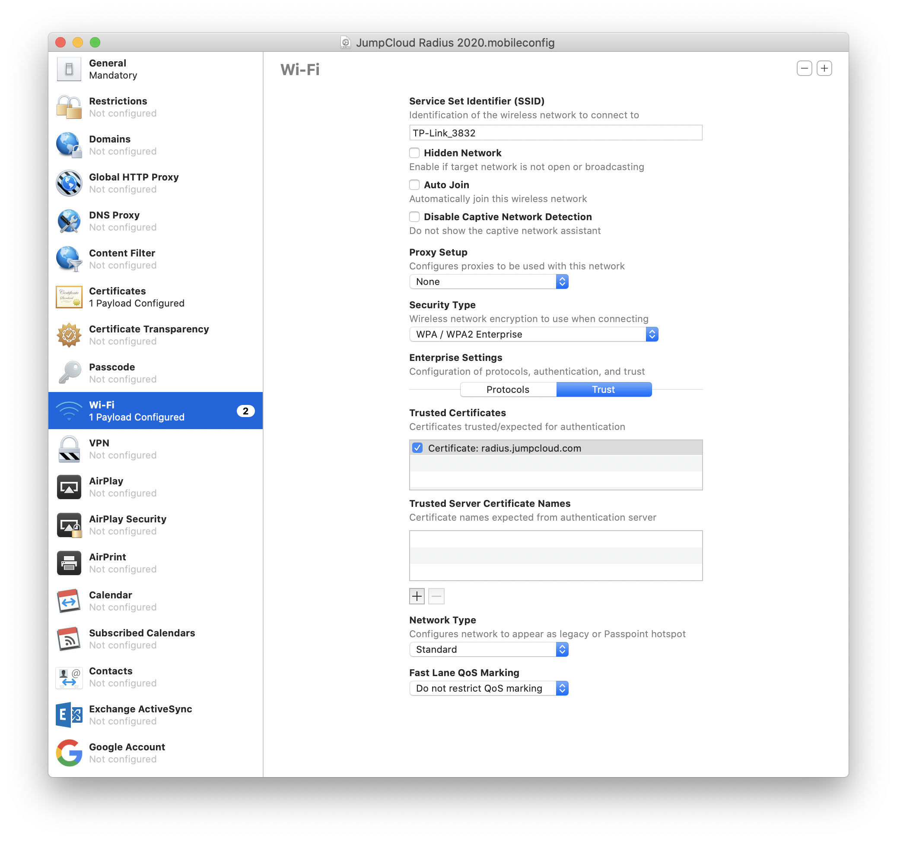

Distribute this profile to JumpCloud systems through [Custom MDM profiles](https://jumpcloud.com/blog/custom-configuration-profiles).

### Create a System Extension Profile

[Kernel Extensions](https://support.apple.com/guide/deployment-reference-macos/kernel-extensions-in-macos-apd37565d329/web) and [System Extensions](https://support.apple.com/en-us/HT210999) are two disparate yet often confused profile configuration types. In most cases software developers who have previously released Kernel Extensions have already released compatible System Extensions.

System Extension Profiles are often times published by the software vendor that requires the extension. If a system extension is required by an application, the application vendor may publish a system extension .mobileconfig file which can be uploaded to JumpCloud and deployed through [Custom MDM Profiles](https://jumpcloud.com/blog/custom-configuration-profiles)

#### Distributing an App with System Extension Profile

System extensions can be distributed using JumpCloud [Custom MDM Profiles](https://jumpcloud.com/blog/custom-configuration-profiles), in this example we'll follow the steps to distribute [Google Santa](https://github.com/google/santa) - An app to track and block execution of binary applications to a managed macOS system. Google Santa requires a [system extension](https://github.com/google/santa/blob/main/docs/deployment/system-extension-policy.santa.example.mobileconfig) to run the required daemon.

System Extensions can be deployed to systems before their corresponding application is installed on a managed system.

#### Google Santa distribution steps

First deploy the necessary profiles to a JumpCloud test system

* Distribute the required [Google Santa System Extension profile](https://github.com/google/santa/blob/main/docs/deployment/system-extension-policy.santa.example.mobileconfig) to a JumpCloud system through [Custom MDM profiles](https://jumpcloud.com/blog/custom-configuration-profiles).
* Distribute the required [PPPC](https://github.com/google/santa/blob/main/docs/deployment/tcc.configuration-profile-policy.santa.example.mobileconfig) and [notification](https://github.com/google/santa/blob/main/docs/deployment/notificationsettings.santa.example.mobileconfig) profiles o a JumpCloud system through [Custom MDM profiles](https://jumpcloud.com/blog/custom-configuration-profiles).


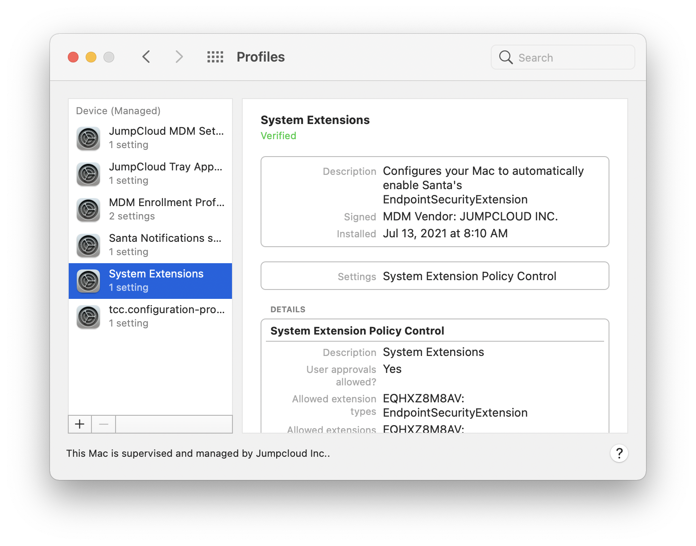

Then deploy the Google Santa application to a JumpCloud test system. Applications can be distributed though commands or installed manually. In this instance, I've compiled a custom pkg, uploaded it to my deployment server and set the JumpCloud [Software Management](https://jumpcloud-support.force.com/support/s/article/Software-Management-Mac-OS) feature to deploy the Santa App.


After installation on a system, the binary application runs as expected without user input or system extension approval.


### Create a Privacy Preference Policy Control Profile

#### About PPPC Profiles

In macOS Mojave, Apple introduced several security controls to enable apps to empower users to control whether an app should be allowed to access files or application data. The apple prompts stating that “”Some Application” would like to access files in your Downloads folder” for example stems from this security measure. Apple is placing the user in control of their data.

System administrators can choose to whitelist these applications using Privacy Preference Policy Controls (PPPC) profiles. As long as an application is [codesigned](https://developer.apple.com/library/archive/documentation/Security/Conceptual/CodeSigningGuide/Procedures/Procedures.html), that application can be whitelisted though a PPPC profile, the only other requirement being that the MDM whitelisting that profile be either user approved or enrolled in DEP on that particular system.

PPPC Profiles can been created with tools like [imazing Profile Editor](https://imazing.com/profile-editor/download) or [Apple Configurator 2](https://apps.apple.com/us/app/apple-configurator-2/id1037126344?mt=12). Other tools such as [PPPC Utility](https://github.com/jamf/PPPC-Utility) were built to make the process of PPPC profile creation as simple as possible. PPPC Utility also allows .mobileconfig files to be exported and distributed through [Custom MDM profiles](https://jumpcloud.com/blog/custom-configuration-profiles).

#### Example PPPC Profile

The example PPPC profile below contains a payload for the Zoom Application, where the "Accessibility" and "Downloads Folder" settings have been set to "Allow".

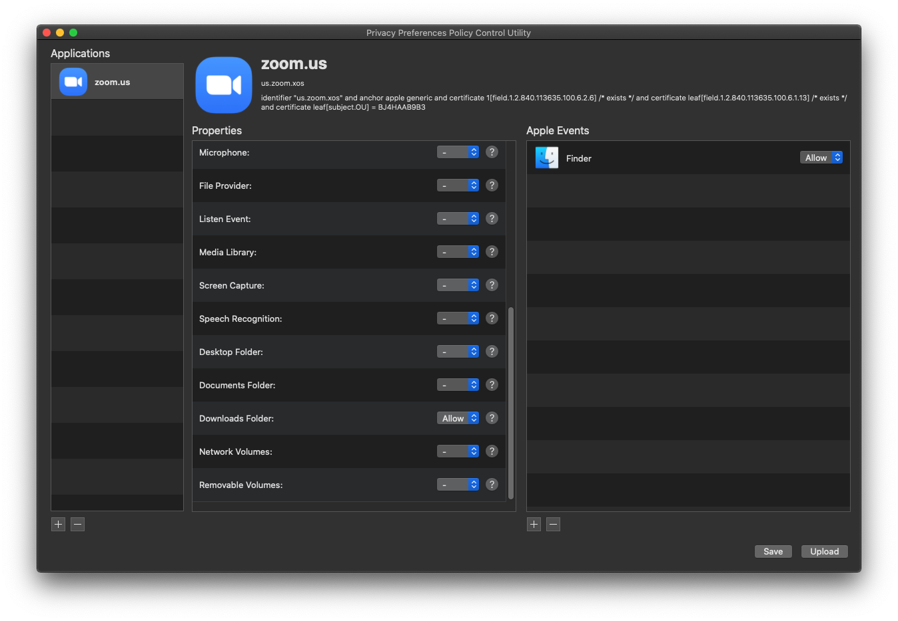

This payload prevents users from being notified with with the following message when first launching the Zoom app:

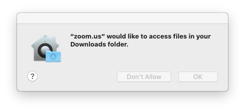

Instead, system users are brought right into the Zoom Application.

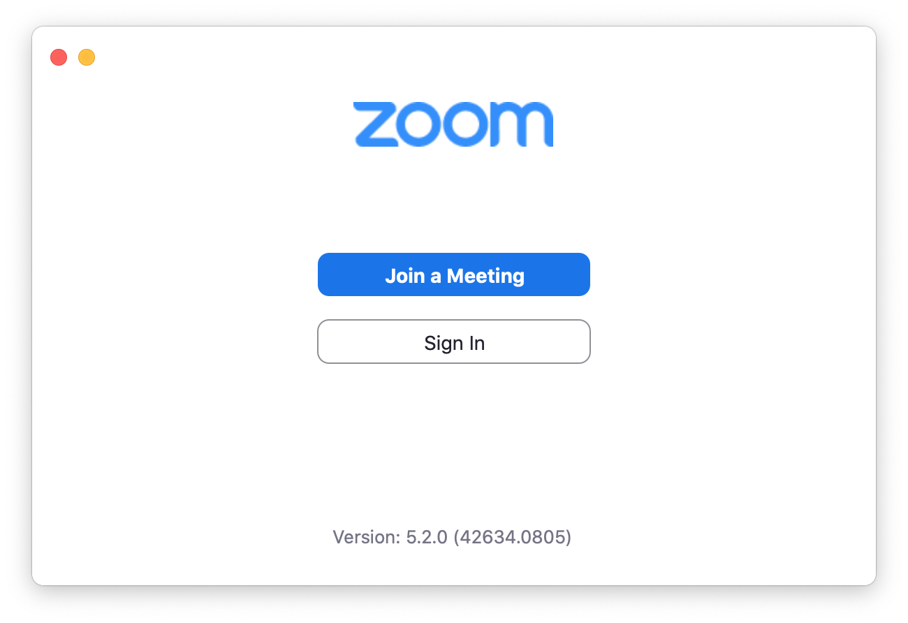

#### Example PPPC Profile for the JumpCloud Agent

The JumpCloud Agent does more than provision and manage users on systems. It’s also serves as the binary application on your system that invokes commands issued from the JumpCloud console. To ensure commands from the JumpCloud console can take advantage of PPPC policy settings, both the JumpCloud-Agent and the bash binary (which is called by the JumpCloud Agent) need to be added to a PPPC profile. The JumpCloud-Agent binary is generally hidden from the user in the /opt/jc/ directory, you wouldn't be able to simply browse to its location without changing permissions. The [jumpcloud-agent.mobileconfig](./profiles/JumpCloud-Agent.mobileconfig) profile template contains the paths to both binary files and a payload to "Allow" access to "SystemPolicyAllFiles". That profile template can be imported in PPPC Utility to modify preference permissions.

The code signatures in the [example profile](./profiles/JumpCloud-Agent.mobileconfig) should match the values below:

To get the code-sign signature of the JumpCloud Agent:

`sudo codesign -dr - /opt/jc/bin/jumpcloud-agent`

Should return:

`Executable=/opt/jc/bin/jumpcloud-agent`

`designated => identifier "jumpcloud-agent" and anchor apple generic and certificate 1[field.1.2.840.113635.100.6.2.6] /* exists */ and certificate leaf[field.1.2.840.113635.100.6.1.13] /* exists */ and certificate leaf[subject.OU] = N985MXSH85`

The identifier of the agent is listed after `designated =>` this identifier data can be used to populate PPPC profiles to automate actions on macOS systems

To get the code-sign signature of the Bash binary:

`sudo codesign -dr - /bin/bash`

Should return:

`Executable=/bin/bash`

`designated => identifier "com.apple.bash" and anchor apple`

## Export a profile

Assuming a profile is ready for deployment. Save and Export the profile using the iMazing Profile Editor file menu. File > Save As...

On the export menu, choose a location to save the profile. The profile will be uploaded and sent to systems with JumpCloud's Custom MDM Configuration Profile.


## Other Considerations

### UUID of generated profiles

If downloading an example repo from this or other repositories, it may be worth the time to generate a new UUID when saving a .mobileconfig profile to easily identify a profile during system audit and later inspection.

To generate a Unique Identifier for a profile open terminal and run: `uuidgen`

### Removal of profiles

To remove a profile distributed with [Custom MDM profile](https://jumpcloud.com/blog/custom-configuration-profiles), remove the system from the scope of the policy. The profile will immediately be removed from the target system.

To identify a profile already installed on a macOS system, run the `sudo profiles -P` command to view all profiles currently installed on a system.


## .mobileconfig Profile Examples

Members of the mac administrator community have published useful profile .mobileconfig files on GitHub. If you are interested in a community written management profile, read and test the profile before distribution to production systems.

This repository contains several custom .mobileconfig profiles within the [profiles](./profiles/) directory.

For additional .mobileconfig profiles, consider browsing [Rich Trouton's Profiles](https://github.com/rtrouton/profiles) repository on GitHub. Rich's profiles repository contains many .mobileconfig settings profiles admins may wish to deploy to manage their systems.
